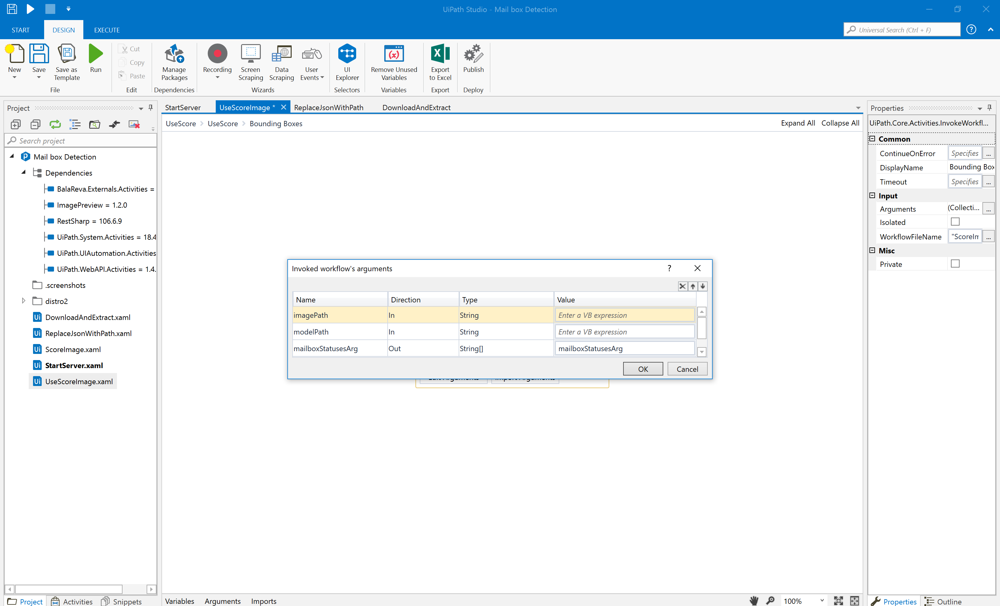

Workflows for Mailbox detection
-----------------------------------

File Descriptions
----------------------
ScoreImage.xaml: For use after the server is started. This allows you to send an image specified as a file path to 
the server for detection. This is meant to be more of an example that should be integrated in to a larger workflow.

StartServer.xaml: The main entry point. This contains the whole workflow for starting a server.

DownloadAndExtract.xaml automatically downloads and extracts a server where the
mail box detection model will run

ReplaceJsonWithPath.xaml: Handles configuring the server configuration (a json file) to point to your current directory
where you are running the workflow. This is necessary to start the server it (happens automatically)

Intended usage
------------------------------------

Run StartServer.xaml first. This will download a server distribution from the releases
of this repository containing everything needed to run the model.

After this, ensure the server output has "Started Veticle" in the text.

If there are any exceptions, please file a github issue.

To test it, submit a test image using ScoreImage.xaml. This is a workflow that contains
an http request that handles calling the server via some configured parameters.

The only thing that needs to be changed for your own custom image is the image path variable in the workflow.

After this, a series of alerts will display indicating the output from the model and will also display an
image that was created that displays the labels found in the image.

Integration usage
------------------------------

The json output from the model should be used and integrated in to a larger workflow
that takes action on whether there is mail present in the submitted picture.

 A sample workflow named UsedScoreImage.xaml is bundled
 with the server to show how to invoke the server.

 You pass in an input image path and you can get output from the server.

  
 
  The workflow uses InvokeWorkflowFile
 on the ScoreImage.xaml workflow.  This contains the 
 actual logic for using the server.

 

 All the end user needs to do is configure the image path.

 

After wards, the workflow will output the coordinates and labels that are to be used in an external integration:

 

Troubleshooting
--------------------------------

If the download fails, follow the following steps:

1. Download the [zip file](https://github.com/agibsonccc/mailboxdetection-workflow/releases/download/1.0/distro.zip)
containing the model and server. Extract it to the directory where your worfklows are.

2. Run ReplaceJsonWithPath.xaml. This will configure the server to start using the proper directory. This is required to start the server.
   
   

3. Run StartProcess.xaml.

If the UseScoreImage fails to run the first time as intended above, this maybe due to a request time out due to the server
needing to startup the first time. Just rerun the workflow
and you should see the intended results.
